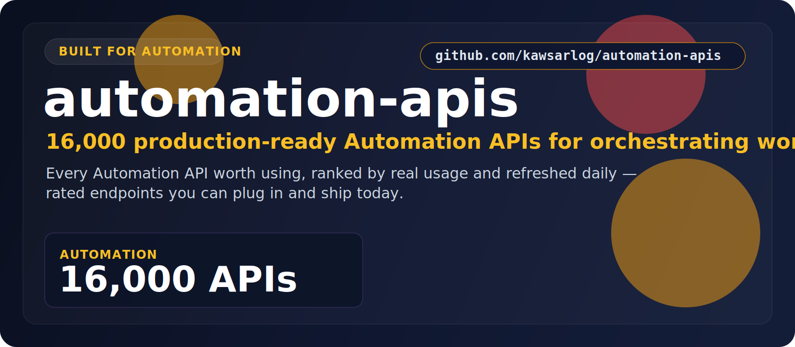

  

  <a href="#at-a-glance"><b>At a Glance</b></a> &nbsp;•&nbsp;
  <a href="#the-categories"><b>Categories</b></a> &nbsp;•&nbsp;
  <a href="#start-here"><b>Start Here</b></a> &nbsp;•&nbsp;
  <a href="#built-for"><b>Built For</b></a> &nbsp;•&nbsp;
  <a href="#why-this-repo"><b>Why This Repo</b></a>

## At a Glance

> **16,000** production-ready Automation APIs.

A focused, always-fresh index of Automation APIs for orchestrating workflows and killing manual busywork. Every entry is rated, shows real user counts, and is refreshed daily — so you find the right one fast.

| Metric | Value |
|--------|-------|
| **Total APIs** | **16,000** |
| **Categories** | 1 |
| **Last updated** | 2026-07-16 |
| **Update cadence** | Daily, automated |

## The Categories

<table>
  <tr>
    <td width="100%" valign="top">
      <h3>Automation</h3>
      
<strong>16,000 APIs</strong>

      
Workflow orchestration, task automation, and RPA endpoints that remove manual busywork.

      
<a href="./Automation/"><strong>Open Automation &rarr;</strong></a>

    </td>
  </tr>
</table>

## Start Here

1. Pick the category that matches what you're building.
2. Open its folder and scan the API names, ratings, and user counts.
3. Click through to the provider page for docs, pricing, and setup.
4. Shortlist in minutes — no digging through unrelated categories.

## Explore the Stack

<strong>Automation — 16,000 APIs</strong>

Workflow orchestration, task automation, and RPA endpoints that remove manual busywork.

[Browse Automation APIs &rarr;](./Automation/)

## Built For

<table>
  <tr>
    <td width="25%" align="center"><strong>Workflow engines</strong></td>
    <td width="25%" align="center"><strong>No-code builders</strong></td>
    <td width="25%" align="center"><strong>RPA pipelines</strong></td>
    <td width="25%" align="center"><strong>Task schedulers</strong></td>
  </tr>
  <tr>
    <td width="25%" align="center"><strong>Ops tooling</strong></td>
    <td width="25%" align="center"><strong>Internal automation</strong></td>
    <td width="25%" align="center"><strong>Data pipelines</strong></td>
    <td width="25%" align="center"><strong>Bots and agents</strong></td>
  </tr>
</table>

## Why This Repo

- **Opinionated, not exhaustive.** Only the categories that matter here — no clutter.
- **Always fresh.** A scheduled job re-scrapes the source and updates the counts daily.
- **Fast to scan.** Ratings and real usage numbers surface the APIs worth your time.
- **Consistent.** Every category follows the same clean, sortable layout.

## Star History

---

**16,000 APIs** across **1 categories** — updated 2026-07-16
 If this saved you time, a star helps others find it.

